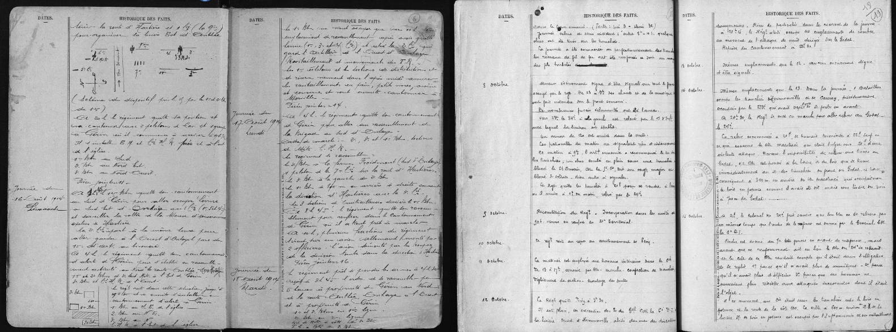
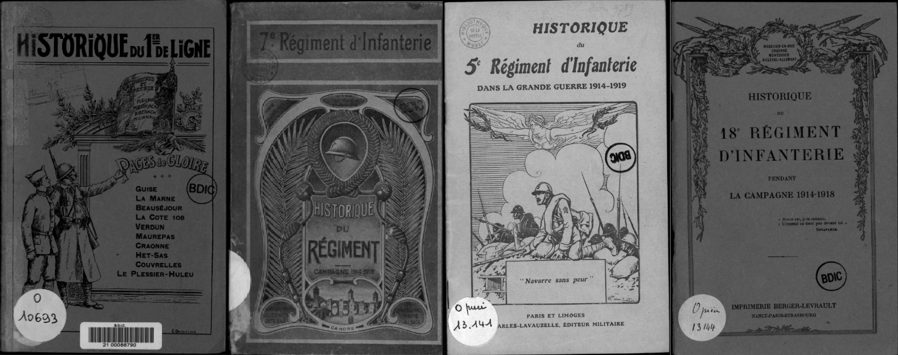

# WW1 Map - [AI in Action](https://ai-in-action.devpost.com/) ✌️

**WW1 Map** is an interactive map that visualizes the movements and actions of French infantry regiments during World War I.

It is based exclusively on **authentic historical data**, extracted from regimental histories and processed using **Gemini (thinking mode)** to identify meaningful events. The resulting data is structured and stored in a **MongoDB** database, then displayed on the map in a clear and accessible format.

This project was inspired by data visualizations like **Ventusky**, with the goal of making **invisible or abstract information visible and intuitive**, bringing forgotten documents to life.

> 🛠️ The project is still under development.

    

---

## Features

- Display of a regiment’s events: movements, battles, orders, losses, etc.
- Interactive map with geolocated actions
- Filters by date and location
- Display of the source document used to extract each event

## Next Steps

- Display complete regiment paths on the map
- Show the exact page from the source for better historical context
- Embed all events into a vector database for LLM-based querying

## Data Processing

During World War I, French regiments maintained [**Journaux de Marche et Opérations (JMO)**](https://www.memoiredeshommes.sga.defense.gouv.fr/fr/article.php?larub=2&titre=journaux-des-unites-engagees-dans-la-premiere-guerre-mondiale), or war diaries, where they recorded daily operations: troop movements, engagements, reconnaissance, positions, losses—sometimes with maps or sketches.  
These were **handwritten on the frontlines**, often under harsh and improvised conditions.

  

[Examples of JMOs](https://www.memoiredeshommes.sga.defense.gouv.fr/fr/arkotheque/visionneuse/visionneuse.php?arko=YToxMDp7czoxMDoidHlwZV9mb25kcyI7czo3OiJhcmtvX2lyIjtzOjg6ImltZ190eXBlIjtzOjM6ImpwZyI7czo0OiJyZWYwIjtzOjE6IjEiO3M6NDoicmVmMSI7czoxOiI2IjtzOjQ6InJlZjIiO2k6NztzOjQ6InJlZjMiO3M6NzE6IjFHTS9KVU5JVEVTMTQxOC9MT1QwMS8yNl9OXzU3MV8wMDEvU0hER1JfX0dSXzI2X05fNTcxX18wMDFfXzAwMDFfX1QuSlBHIjtzOjQ6InJlZjQiO3M6NzE6IjFHTS9KVU5JVEVTMTQxOC9MT1QwMS8yNl9OXzU3MV8wMDEvU0hER1JfX0dSXzI2X05fNTcxX18wMDFfXzAwMzRfX1QuSlBHIjtzOjE4OiJpZF9hcmtfZWFkX2ZhbWlsbGUiO2k6MDtzOjE2OiJ2aXNpb25uZXVzZV9odG1sIjtiOjE7czoyMToidmlzaW9ubmV1c2VfaHRtbF9tb2RlIjtzOjQ6InByb2QiO30=#uielem_move=0%2C0&uielem_zoom=100), [Full list](https://www.memoiredeshommes.sga.defense.gouv.fr/fr/article.php?larub=2&titre=journaux-des-unites-engagees-dans-la-premiere-guerre-mondiale)

After the war, mostly between **1919 and 1920**, [**regimental histories**](https://argonnaute.parisnanterre.fr/ark:/14707/sd32rc9tfhj4) were published, often written by former officers or military historians.  
They synthesize the JMOs, enhance them with strategic context, maps, and narrative accounts.

  

[Examples of regimental histories](https://argonnaute.parisnanterre.fr/media/ec6574a6-6a63-4dcb-805d-a384f8e4e23e.pdf), [Full list](https://argonnaute.parisnanterre.fr/ark:/14707/5v76d8132s4h)

Each regiment has its own historical record, from which events are extracted.

## Processing Pipeline

### 📥 [Book Extraction](https://github.com/Spixz/ww1_map/tree/main/data_processing/process_regiments_from_argonnaute)
- Downloads regimental histories from [Argonnaute](https://argonnaute.parisnanterre.fr/ark:/14707/5v76d8132s4h) using a [Violentmonkey script](https://github.com/Spixz/ww1_map/blob/main/data_processing/process_regiments_from_argonnaute/extract_regiments.violentmonkey.js)
- Output file: [regiments_complet.json](https://github.com/Spixz/ww1_map/blob/main/data_processing/process_regiments_from_argonnaute/regiments_complet.json)

### 📄 [PDF to Markdown Conversion](https://github.com/Spixz/ww1_map/tree/main/data_processing/tools/pdf_to_markdown)
- Converts PDF documents to Markdown format to make them usable by LLMs

### 🧠 [Event Extraction](https://github.com/Spixz/ww1_map/tree/main/data_processing/tools/extract_events_from_document)
- Generates a **regimental summary** using this [prompt](https://github.com/Spixz/ww1_map/blob/main/data_processing/tools/extract_events_from_document/src/extract_events_from_document/prompts/create_regiment_description_instruction.txt)
- Extracts [three types](https://github.com/Spixz/ww1_map/blob/main/doc/events_sample.json) of events using this [prompt](https://github.com/Spixz/ww1_map/blob/main/data_processing/tools/extract_events_from_document/src/extract_events_from_document/prompts/extract_events_instruction.txt):
  - Political events  
  - Troop movements  
  - Military engagements
- Stores the events in a **MongoDB** database

### 🌍 [Data Enrichment](https://github.com/Spixz/ww1_map/tree/main/data_processing/events_location_finder)
- **Find the exact location of places mentioned** in the event descriptions and titles in order to **convert them into GPS coordinates**. [(prompts)](https://github.com/Spixz/ww1_map/tree/main/data_processing/events_location_finder/src/events_location_finder/prompts)

## 🙏 Credits

Big thanks to **Google** for the generous **Gemini API free tier**.